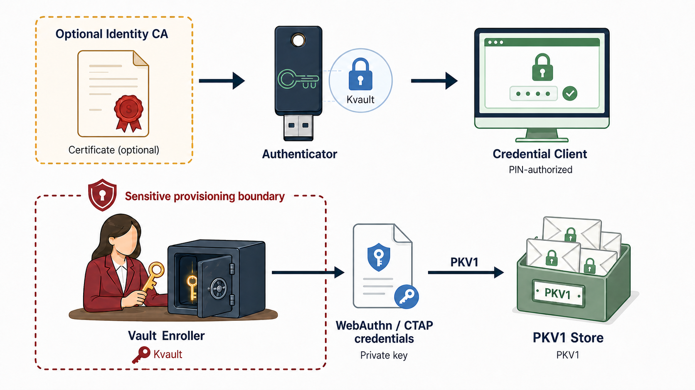
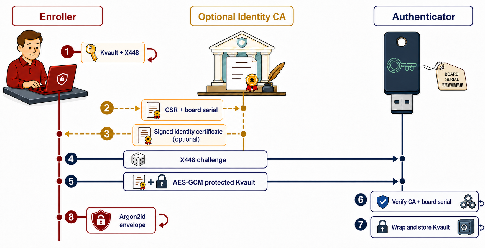
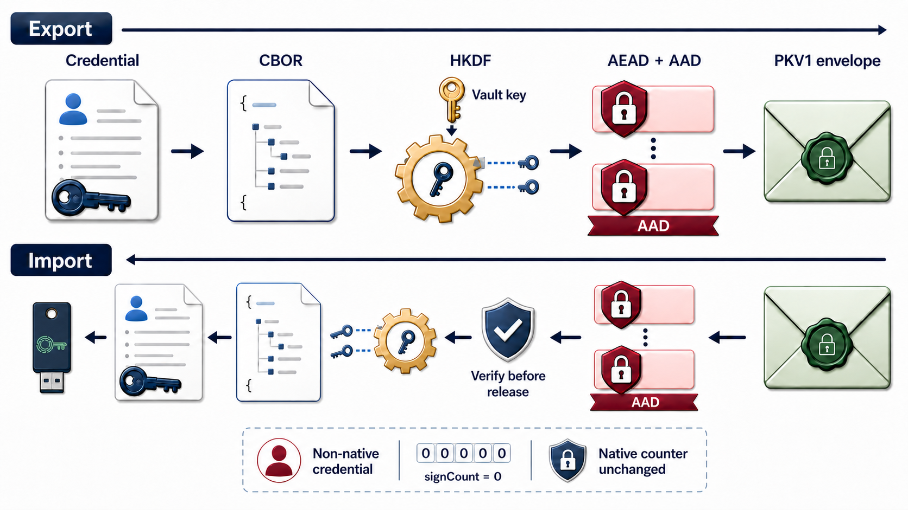
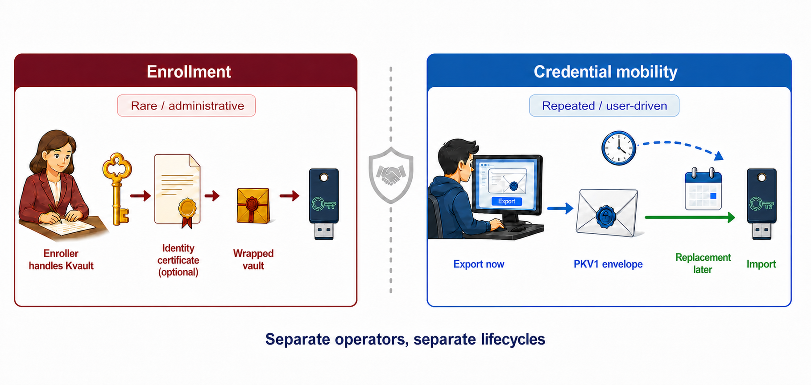

# Vaulted Passkeys: A Device-Bound Proposal for Authenticated Credential Export and Import

**Pol Henarejos, Ph.D.**  
Centre Tecnològic de Telecomunicacions de Catalunya (CTTC), Castelldefels, Spain

> **Status:** Non-normative research proposal. This document is not a FIDO, W3C, IETF, or PicoKeys standard.

## Abstract

Hardware authenticators deliberately resist private-key extraction, yet replacement, disaster recovery, and controlled migration create a legitimate need for portability. Existing guidance for device-bound credentials commonly reduces recovery risk by registering an additional authenticator before failure. That creates an independent credential registration and requires replacement hardware to exist in advance; it is redundancy, not a backup of the original credential. This paper addresses the resulting recovery gap by exporting protected credential state while the source is available and restoring it to hardware acquired later, without cloning a complete authenticator or exposing plaintext private keys to routine desktop software.

We propose Vaulted Passkeys, a device-bound architecture in which a random 256-bit `Kvault` protects authenticated PKV1 credential envelopes through HKDF-separated keys and four explicit AEAD profiles. The design separates a rare enrollment ceremony from repeated export/import operations, allowing different entities to operate them. It also separates the required vault mechanism from an optional identity layer: an organization-operated certificate authority (CA), not an application backend, may attest the enroller and target board, while anonymous deployments may omit this layer.

The paper contributes a role-separated system model, wire format, key schedule, threat analysis, implementation mapping, and falsifiable evaluation plan. The enroller is security-critical because it handles plaintext `Kvault`; its separate recovery copy is protected by a passphrase-derived Argon2id key and AES-GCM. The prototype demonstrates feasibility but is neither a formal security proof nor a proposed final standard.

**Index Terms:** passkeys, WebAuthn, CTAP2, hardware authenticator, credential migration, authenticated encryption, X448, HKDF, provisioning, key separation, proposal.

## 1. Introduction

The central promise of a passkey is that authentication does not require a bearer copy of a password or a reusable private key in an application database. A credential private key is generated, stored, and used under the control of an authenticator or credential provider. WebAuthn describes discoverable credentials as credential sources stored on the client side, while CTAP defines authenticator operations for creating, using, and managing such credentials [[1]](#ref-1), [[2]](#ref-2). These specifications focus on authentication ceremonies and credential management; they do not define a generic command by which a hardware authenticator exports every credential private key to an external application.

That omission is reasonable from a conservative security perspective. Private-key export is powerful: an application that can invoke it may turn phishing-resistant credentials into portable key material. Yet the absence of a controlled mechanism creates practical pressure. Organizations need hardware-backed backup and recovery. Users replace or repair tokens. FIDO Alliance recovery guidance recommends registering multiple authenticators to reduce account-recovery needs and, when that is infeasible, repeating identity proofing or onboarding [[3]](#ref-3). This is useful redundancy, but it is not a backup of an existing credential: every relying party creates another credential registration, and the spare authenticator must be available and registered before the primary device fails.

The temporal distinction is central. Registration redundancy requires two usable authenticators during the preparation phase—effectively requiring the user or organization to own the spare from day zero, or at least before any loss. Vaulted Passkeys instead permits an authorized export while the source board works, secure offline retention of the PKV1 blob and `Kvault` recovery material, and acquisition of the replacement board only when it is actually needed. The replacement is then enrolled into the same vault domain and imports the protected credential. The cost is shifted from idle spare hardware to disciplined custody of encrypted recovery artifacts and their passphrase.

Vaulted Passkeys explores a middle position. It does not make export a normal WebAuthn operation and does not claim that every authenticator should export keys. Instead, it proposes a gated capability for a specifically enrolled vault. The vault layer provisions `Kvault` into the device and performs PIN-authorized export/import of opaque authenticated envelopes. The identity layer is separate and optional: when an organization wants to know which authorized provisioning service supplied the vault, a firmware-embedded CA root and board-serial check provide that evidence. The routine operator never receives the plaintext private key; the GUI receives only the protected PKV1 blob and metadata.

### 1.1 Problem Statements and Proposed Responses

The work is organized around four independently challengeable problems and corresponding design responses:

- **Deferred portability—Issue:** A replacement board may not exist at export time. **Proposed response:** PKV1 exports an authorized credential for restoration to a distinct board acquired later, without full-device cloning.
- **Role separation—Issue:** Routine management should not receive vault roots or plaintext keys. **Proposed response:** Separate enrollment and mobility ceremonies enforce this boundary.
- **Optional identity—Issue:** Identity attribution must not become a vault-cryptography dependency. **Proposed response:** An optional CA layer separately authenticates the provisioning authority and target board.
- **Recoverability boundary—Issue:** Loss scenarios require defined outcomes. **Proposed response:** The threat model specifies the consequences of losing or compromising a board, PKV1 blob, `Kvault` recovery envelope, or passphrase.

### 1.2 Contributions and Claim Boundary

The paper contributes:

1. A two-layer model separating credential protection from optional provisioning identity.
2. A two-ceremony model separating the security-critical enroller from the routine credential manager.
3. The PKV1 envelope and context-separated key schedule.
4. An implementation across firmware, enroller, GUI, and tests.
5. A threat model and evaluation protocol intended to make failures observable.

The contribution is a design proposal and open implementation artifact. It does not claim universal deployability, cryptographic novelty, formal verification, or measured production readiness.

### 1.3 Reading Guide

> **Plain-language model:** `Kvault` is the master secret shared by members of one vault domain. PKV1 is a locked package containing one credential. The authenticator PIN/UV token is the authorization gate for creating or opening that package. The optional CA certificate is an identity badge for provisioning; it is not the encryption key and is not required when anonymity is the policy.

> **Implementation context and neutrality:** For clarity and reproducibility, this paper names the PicoKeys open-source ecosystem [[4]](#ref-4) when discussing the evaluated prototype: Pico-FIDO is the reference vault-capable authenticator, PicoKeyApp is the reference credential-management client, and `pico-vault-enroller` is the reference security-critical enroller. These names identify implementations, not required protocol actors or dependencies. Except where the paper reports implementation-specific behavior, the architecture, roles, wire format, and security arguments are intended to be vendor- and company-neutral and may be implemented by independent authenticators, enrollers, clients, and identity authorities.

## 2. State of the Art

### 2.1 WebAuthn and CTAP

WebAuthn scopes a credential to a relying party (RP) and defines browser-mediated creation and assertion ceremonies. A discoverable credential can be selected using an RP identifier without the RP first supplying a credential identifier [[1]](#ref-1). CTAP supplies the client-to-authenticator interface and includes credential-management operations for discoverable credentials [[2]](#ref-2). Together, these technologies provide a strong authentication substrate, but their ordinary control model is intentionally asymmetric: the RP receives a public key and assertions, while the credential private key remains in the authenticator or provider.

WebAuthn Level 3 nevertheless models backup-capable credentials through the Backup Eligibility (`BE`) and Backup State (`BS`) flags and recognizes that backup may occur through mechanisms including manual import/export [[1]](#ref-1). Those semantics describe credential properties and relying-party-visible state; WebAuthn explicitly does not define a protocol for backing up private keys or sharing them between authenticators. CTAP 2.3 carries authenticator data and provides credential-management operations to enumerate, inspect, update, and delete discoverable credentials, but it does not transpose the WebAuthn backup model into standardized authenticator commands for exporting or importing a credential private key [[2]](#ref-2). This missing client-to-authenticator operation is the specific protocol gap addressed experimentally by PKV1 and the vendor Vault commands.

### 2.2 Credential Exchange and Provider Migration

The FIDO Alliance Credential Exchange Protocol (CXP) and Credential Exchange Format (CXF) are the closest adjacent work. As of this draft, CXF 1.0 is a Proposed Standard with March 2026 errata, whereas CXP remains a Working Draft. CXP describes provider-to-provider export/import, request and response modes, Diffie-Hellman or HPKE-based protection, and an archive containing credential payloads. CXF provides the credential representation. Vaulted Passkeys shares the goal of avoiding cleartext CSV-style migration and agrees that user or organizational authorization is essential [[5]](#ref-5), [[6]](#ref-6).

The trust boundary differs. CXP is a provider-interoperability protocol: the exporter and importer are credential providers. Vaulted Passkeys is narrower and device-centric. Its exporter is a hardware-authenticator command, its root secret is enrolled into that device, and its PKV1 envelope is deliberately bound to a vault identity and board serial. A future implementation could map PKV1 into CXF/CXP, but this proposal does not claim PKV1 interoperability with CXF.

### 2.3 Cryptographic Building Blocks

The proposal composes established primitives rather than inventing new cryptography:

- X448 for the enrollment key agreement [[7]](#ref-7).
- HKDF-SHA-256 for context-separated key derivation [[8]](#ref-8).
- ChaCha20-Poly1305 [[9]](#ref-9) and AES-256-GCM [[10]](#ref-10) for authenticated encryption with associated data.
- Argon2id for protecting the enroller's recovery copy of `Kvault` under a user-supplied passphrase [[11]](#ref-11).
- CBOR and COSE algorithm identifiers for the authenticated credential payload [[12]](#ref-12).
- X.509 certificates and a firmware-trusted CA root for the optional identity layer.

The research contribution is architectural: how these primitives, device policy, optional certificate identity, and operational roles are composed for a constrained hardware credential-mobility capability.

### 2.4 Comparative Positioning

The following comparison is architectural rather than a claim of superiority in every deployment. Provider synchronization may be preferable for consumer convenience, while re-registration is preferable whenever private-key portability is forbidden.

| Property | Full-board clone | Provider exchange / sync | Vaulted Passkeys |
|---|---|---|---|
| Unit moved | Complete device state | Provider-defined archive or synchronized credential | One selected credential envelope |
| Device identity | May be duplicated | Usually abstracted by provider | Source and target remain distinct |
| Routine software sees plaintext key | Clone tooling may see raw storage | Depends on provider boundary | No; GUI handles opaque PKV1 |
| Relying-party change | None, but clone semantics are ambiguous | None when ecosystem supports it | None |
| Recovery blast radius | Entire board state | Provider account/archive | Selected credential plus its vault domain |
| Primary dependency | Hardware/storage equivalence | Provider interoperability and account trust | Enrolled vault, firmware policy, and `Kvault` recovery |

This state-of-the-art discussion is deliberately bounded to adjacent specifications and primitive definitions. A systematic review of commercial implementations, patents, hardware backup products, and unpublished vendor mechanisms remains future work; absence from this section is not evidence that no comparable mechanism exists.

## 3. Motivation and Design Goals

The design is motivated by a tension: portability is useful, but uncontrolled portability weakens the security model that makes passkeys attractive. Export is therefore treated as a high-impact administrative capability rather than a convenience API.

### 3.1 Registration Redundancy Is Not Credential Backup

FIDO Alliance guidance correctly observes that account recovery can be reduced by registering multiple authenticators [[3]](#ref-3). However, this creates two independent credential key pairs and two relying-party records. It does not preserve the first credential and cannot reconstruct it. In storage terminology, it is active redundancy: both authenticators must exist, be enrolled with every relevant relying party, and remain governed throughout their lifetimes.

This distinction matters after failure. If the primary board is lost before a second authenticator has been registered, the user cannot derive the missing registrations from the surviving relying-party public keys. The user must invoke each relying party's recovery procedure, repeat identity proofing where required, and create new credentials. Even when a spare exists, adding a new relying party later requires remembering to register both boards again; otherwise protection silently diverges.

A credential backup has a different temporal property: it captures recoverable state at time `t0` and permits restoration onto replacement media obtained at time `t1`. Vaulted Passkeys provides that decoupling. While the source board is healthy, an authorized operator exports selected PKV1 blobs and preserves the Argon2id-protected `Kvault` recovery envelope [[11]](#ref-11). No destination board is required at export time. If replacement later becomes necessary, a newly purchased board is enrolled into the same vault domain and imports the selected blobs.

| Property | Register another authenticator | Vaulted Passkeys backup |
|---|---|---|
| Credential continuity | New key pair and RP registration | Preserves the exported credential record |
| Spare hardware at preparation time | Required | Not required |
| Work before failure | Register the spare separately at every RP | Export selected blobs and protect recovery material |
| Work after failure | Use an already-registered spare | Buy a board, enroll it into the vault, then import |
| Failure if preparation is incomplete | RP recovery or renewed identity proofing | Unavailable blobs or `Kvault` material make recovery impossible |
| Stored recovery asset | A second live authenticator | Encrypted PKV1 blobs plus protected `Kvault` envelope and passphrase |

> **Core motivation:** Registering a second board protects availability through pre-provisioned redundancy. PKV1 protects availability through deferred restoration. The proposal does not eliminate preparation: it replaces the requirement to own and register spare hardware in advance with the requirement to preserve encrypted credential blobs, the Argon2id-protected `Kvault` envelope, and its passphrase.

### 3.2 Credential Export Instead of Full-Board Cloning

A complete board clone is a tempting recovery model: copy all flash, keys, configuration, counters, and credential records to another board. It is the wrong security boundary for credential mobility because a board is more than a credential container. Its state includes device identity, attestation material, PIN and retry state, firmware configuration, monotonic counters, manufacturing data, registration policy, and potentially unrelated application secrets. Copying that state creates an indistinguishable second device and makes identity, revocation, counter continuity, and ownership difficult to reason about.

#### 3.2.1 Least-privilege recovery

PKV1 exports only the credential selected by an authorized user and carries only the metadata required to recreate that credential. The target board keeps its own hardware identity, attestation keys, PIN state, firmware state, and board serial. Recovery transfers a credential capability, not an entire security principal. This reduces the blast radius when a backup is copied, misplaced, or handled by a different operator.

#### 3.2.2 Identity and lifecycle safety

Cloning a board can duplicate an identity that relying parties or an organization expect to be unique. It can also roll back counters or replicate state intended to change monotonically. Vaulted Passkeys keeps identity and credential mobility separate. The optional identity layer can certify who provisioned a vault and which board was enrolled, but PKV1 does not clone the board certificate, board serial, attestation identity, or device-internal key-management state.

#### 3.2.3 Practical recovery

A full clone is tightly coupled to exact hardware, firmware layout, storage format, and source-board lifecycle. A credential envelope is a smaller, inspectable unit with an explicit version, algorithm profile, vault identifier, credential hash, and authenticated metadata. It is better suited to controlled backup, selective restoration, and future format bridging. The trade-off is deliberate: the proposal does not promise image-level backup of every board function; it promises auditable portability of selected credentials.

### 3.3 Design Goals

1. Keep credential private keys out of the clear during normal GUI export/import. The device creates and consumes the protected envelope; the GUI stores and transports opaque bytes.
2. Keep the vault layer independent from identity policy. `Kvault` provisioning and PKV1 mobility are required; a CA-signed certificate and exact board-serial SAN provide an additional identity check only when an organization needs attribution.
3. Separate responsibilities. The optional identity CA, sensitive enroller, hardware authenticator, and export/import GUI may be different entities with different operational controls.
4. Bind exported data to the intended vault and credential. The vault identifier and credential hash are included in the authenticated envelope header and influence key derivation.
5. Support cryptographic agility without silently changing semantics. Four fixed algorithm profiles make the selected protection visible and testable.
6. Fail closed at trust boundaries. Invalid certificates, incorrect serials, wrong vault identifiers, malformed envelopes, invalid authorization, and AEAD failures reject the operation.
7. Remain compatible with normal passkey use. Relying parties need not change their WebAuthn ceremonies, and export is not part of the ordinary assertion path.

## 4. System Model and Roles

### 4.1 Assets and Trust Boundaries

The protected assets are credential private keys and metadata, `Kvault`, the enroller's recovery state and passphrase, the authenticator's wrapped vault state, PIN/UV authorization tokens, and—when identity is enabled—the CA signing key and issued certificate. Trust boundaries occur between the optional CA and enroller, between enroller and authenticator during provisioning, between GUI and authenticator during mobility, and between local blob storage and its operator. The design intentionally gives no single routine desktop component every asset.

### 4.2 Roles

The roles are defined by security responsibility, not by product boundary. One organization may operate several roles, but the protocol does not require them to be co-located.

| Role | Primary responsibility | Security significance |
|---|---|---|
| Optional identity CA | Signs the certificate for the enroller's X448 public key and board serial when attribution is required. | Compromise enables unauthorized identity claims. The private CA key must be protected and governed. It is not required for anonymous provisioning. |
| Enroller (reference: `pico-vault-enroller`) | Creates `Kvault` and the X448 key pair, obtains the optional certificate, performs enrollment, and stores the encrypted enrollment envelope. | Critical provisioning authority. It handles plaintext `Kvault` and must be open to audit, minimized, and operationally protected. |
| Vault-capable authenticator (reference: Pico-FIDO) | Validates applicable identity data, stores `Kvault` wrapped by a device-internal key, and performs PIN-authorized export/import. | Security boundary that keeps private keys inside the device during routine mobility. |
| Credential-management client (reference: PicoKeyApp) | Unlocks credential management, checks applicable board-registration policy, requests export/import, and persists opaque PKV1 blobs locally. | Should not need `Kvault` or plaintext credential private keys. Local storage remains sensitive because it contains recoverable ciphertext. |
| Relying party | Uses ordinary WebAuthn public keys and assertions. | Does not participate and need not be modified. |

### 4.3 Assumptions

- The authenticator executes the reviewed firmware, and its device-internal key storage is not already compromised.
- The platform provides cryptographically suitable randomness for `Kvault`, X448 keys, challenges, and every AEAD nonce.
- PIN/UV authorization is obtained through the normal CTAP security boundary. An adversary who already controls an authorized session is not prevented from requesting an intentional export.
- The enroller host is trustworthy during the short provisioning ceremony, and operators independently protect its Argon2id envelope and passphrase afterward.
- If identity is enabled, the embedded root, CA issuance process, certificate profile, and board-serial source are governed correctly. Anonymous vault provisioning needs no identity-CA assumption.
- Relying parties accept a restored credential because its key pair and credential identifier are preserved; policy-specific RP behavior must still be tested.

### 4.4 Non-goals

- A general API for arbitrary private-key extraction, unattended cloud synchronization, or transparent cloning of flash and device identity.
- Protection against invasive physical extraction, side-channel analysis, fault injection, malicious firmware replacement, or a compromised build pipeline.
- Recovery when every copy of `Kvault` or its usable recovery material is lost; deliberate unrecoverability is part of the model.
- A claim that two sequential AEAD layers are automatically stronger than one correctly implemented AEAD, or that PKV1 should replace CXP/CXF.

## 5. Protocol Overview

The proposal has two layers and two separate ceremonies.

### 5.1 The Required Vault Layer

The vault layer is the cryptographic mechanism that makes credential mobility possible. It does not depend on knowing the human, organization, or service that initiated provisioning. The enroller generates a uniformly random 32-byte `Kvault`, and the device stores it only after the enrollment packet is authenticated. The resulting `vault_id` identifies that secret without revealing it. Later, PKV1 derives credential- and layer-specific keys from `Kvault` and refuses envelopes from another vault.

The vault layer establishes whether a device and an envelope participate in the same protected credential-mobility domain. Attribution of the entity that provisioned the domain is deliberately outside the vault layer and belongs to the optional identity layer.

### 5.2 The Optional Identity Layer

The identity layer is an attribution and provisioning-policy mechanism, not a requirement for vault cryptography. When enabled, the enroller creates an X448 key pair and obtains a certificate signed by an organization's Vault CA. The CA is not a general-purpose backend and does not need to see `Kvault`, credential contents, PKV1 blobs, or routine export/import traffic. Its narrow purpose is to let firmware verify that the provisioning certificate was signed by the trusted CA and identifies the intended board.

Firmware validates the certificate chain against a CA root embedded in firmware and checks for an exact board-serial match in the certificate subject alternative name. A certificate signed by another CA, or a certificate whose serial does not match the board, is rejected at enrollment finish. This check identifies the provisioning authority and intended board; it does not create the vault, protect PKV1, or authorize later exports. If full anonymity is desired, the identity certificate and CA check may be omitted or replaced by another explicit provisioning policy.

### 5.3 Enrollment Ceremony

The enroller generates a uniformly random 32-byte `Kvault` and an X448 private/public key pair. It computes:

```text
vault_id = SHA-256("PicoKeys Vault ID v1" || Kvault)
```

When the optional identity layer is enabled, the enroller sends its X448 public key to the organization's Vault CA. The CA signs a certificate containing the public key in the agreed vault-key extension and the board serial in a DNS-name or URI subject-alternative-name entry. At enrollment finish, firmware searches the certificate SAN sequence for an exact byte-for-byte match to the board's own serial string.

The device's enrollment-begin operation (vendor command `0x05`, subcommand `0x02`) returns a device ephemeral X448 public key and a fresh 32-byte challenge. The enroller derives:

```text
Z    = X448(enroller_private, device_ephemeral_public)
info = "PicoKeys Vault enrollment v1" || challenge || enroller_public || device_ephemeral_public
Ke   = HKDF-SHA256(salt = empty, IKM = Z, info = info, L = 32)
```

When the identity layer is enabled, the finish packet is certificate-length-prefixed, followed by the DER certificate, a 12-byte AES-GCM nonce, and an AES-GCM ciphertext/tag. The encrypted plaintext is `Kvault` followed by a one-byte label length and an optional UTF-8 label. The device performs packet-length checks, optional X.509 parsing, optional CA-chain and serial-SAN validation, X448 public-key extraction, X448/HKDF derivation, and AES-GCM authentication/decryption. Only after applicable checks succeed does it commit the vault key to persistent storage.

The device stores the vault key encrypted under a device-internal key-management secret. Separately, the enroller writes a passphrase-protected recovery envelope. The current implementation derives its 32-byte AES-GCM key [[10]](#ref-10) with Argon2id [[11]](#ref-11) using three iterations, four lanes, and 64 MiB of memory, and authenticates the ciphertext with the fixed AAD `PicoKeys Kvault envelope v1`.

The enroller envelope contains `Kvault`, the enroller's X448 private key, the optional certificate, license association, label, and vault identifier. The device does not need the user's vault passphrase, while the enroller can recover the vault state for later authorized provisioning or recovery.

### 5.4 Separation of Enrollment and Export/Import

Enrollment is sensitive because the enroller sees plaintext `Kvault` and can create the root of credential-mobility authority. Export/import is sensitive differently: it moves recoverable credential material, but can be performed without exposing `Kvault` to the GUI. For example:

1. A provisioning authority operates the open-source `pico-vault-enroller` and handles `Kvault` only during controlled enrollment.
2. When identity attribution is required, an optional CA operator issues board-scoped identity certificates without seeing credential contents or routine export traffic.
3. A user or credential-management operator runs PicoKeyApp and receives only authenticated PKV1 blobs.
4. Relying parties remain unchanged and continue to see normal WebAuthn registration and assertion behavior.

The enroller must be open source because it receives or generates plaintext `Kvault`, derives the Argon2id passphrase-protected envelope, handles the optional CA certificate, and initiates enrollment. A closed enroller would be an unreviewable plaintext-key sink. The separate `pico-vault-enroller` project should therefore have reviewable source, dependencies, build process, release artifacts, and reproducible builds where practical.

## 6. PKV1 Credential Envelope

After enrollment, the device exposes export (`0x04`) and import (`0x05`). Both require valid CTAP PIN/UV authorization with authenticator-configuration permission. Export selects a resident credential and one of four algorithm profiles. The device locates the credential, reconstructs or loads its private key, gathers metadata, serializes a CBOR payload, and encrypts it.

### 6.1 Header and Payload

The current PKV1 header is 86 bytes. The complete header is passed as AEAD associated data, so changing an algorithm identifier, vault identifier, credential hash, board serial, or magic/version value invalidates decryption.

```text
offset  size  field
0       4     magic = 50 4B 56 01 ("PKV1")
4      32     vault_id = SHA-256(domain || Kvault)
36     32     credential_hash = SHA-256(requested credential ID)
68      1     serial_len
69     16     board serial bytes, zero-padded
85      1     algorithm ID (1..4)
86      n     12-byte nonce per AEAD layer
86+n     *     ciphertext followed by one 16-byte tag per layer
```

The body plaintext is a six-entry CBOR map. Integer labels are used to keep the encoding compact and unambiguous:

| Key | CBOR type | Field | Semantics |
|---:|---|---|---|
| 1 | unsigned integer | `version` | Credential-plaintext format version; currently `1`. |
| 2 | byte string | `credential_id` | Stored credential identifier recreated on import. |
| 3 | byte string | `private_key` | Authenticator-private serialization of the credential key material. It is never returned outside the authenticated ciphertext. |
| 4 | text string | `rp_id` | Relying-party identifier associated with the credential. |
| 5 | byte string | `metadata` | A second CBOR map, encoded as bytes, containing the credential fields required by the import path. |
| 6 | byte string | `requested_id` | Identifier supplied to export. Its SHA-256 digest is the `credential_hash` in the PKV1 header and enters the layer-key derivation. |

The distinction between keys 2 and 6 is intentional. The export lookup may accept either the stored credential identifier or another identifier recognized by the authenticator's resident-credential matching logic. Key 2 preserves the canonical stored identifier; key 6 records the exact input that selected it and cryptographically binds that selection to the header.

The byte string under key 5 decodes to the following metadata map. The map may use indefinite-length CBOR encoding; omitted values retain the stated defaults.

| Key | CBOR type | Field | Presence and meaning |
|---:|---|---|---|
| 1 | text string | `rp_id` | Optional RP identifier. |
| 2 | byte string (32 bytes) | `rp_id_hash` | Required SHA-256 RP identifier hash used to index and recreate the credential. |
| 3 | byte string | `user_id` | Optional WebAuthn user handle. |
| 4 | text string | `user_name` | Optional user name. |
| 5 | text string | `user_display_name` | Optional display name. |
| 6 | unsigned integer | `board_creation` | Required implementation creation value retained with the credential. |
| 7 | map | `extensions` | Optional extension state: `credBlob` (byte string), `credProtect` (unsigned integer), `hmac-secret` (boolean), `largeBlobKey` (`true` when enabled), and `thirdPartyPayment` (`true` when enabled). |
| 8 | boolean | `use_sign_count` | Required source-credential preference. For a non-native imported credential, imported status overrides this value: assertions report `signCount = 0` and do not advance the destination board's native counter. |
| 9 | integer | `alg` | Optional COSE algorithm identifier; omission denotes the ES256 default. |
| 10 | integer | `curve` | Optional curve identifier; omission denotes the P-256 default. |
| 11 | map | `options` | Optional credential options; currently the resident-key option `rk` as a boolean. |
| 12 | unsigned integer | `rtc_creation` | Optional real-time-clock creation value. |
| 13 | byte string | `resident_id` | Optional stable resident identifier used by credentials whose key reconstruction depends on it. |

The importer requires all six outer fields and metadata keys 1 (`rp_id`) and 2 (`rp_id_hash`). It rejects duplicate known fields, unsupported plaintext versions, invalid bounds, a `requested_id` whose SHA-256 digest differs from the authenticated header `credential_hash`, an outer RP ID that differs from metadata, an RP hash that differs from `SHA-256(rp_id)`, and inconsistent algorithm, curve, or private-key material. These checks complete before slot selection or persistent writes. The reference credential-management client, PicoKeyApp, transports the resulting PKV1 object as opaque bytes; it does not receive this cleartext CBOR record or `Kvault`. It may separately receive metadata for user-interface presentation, which must not be confused with the encrypted metadata copy inside PKV1.

### 6.2 Key Derivation and Algorithm Profiles

For each credential and layer, the device derives a fresh 32-byte AEAD key:

```text
K(layer) = HKDF-SHA256(
    salt = vault_id,
    IKM  = Kvault,
    info = "PicoKeys Vault enrollment v1" || credential_hash || algorithm || layer,
    L    = 32)
```

The four profiles are:

| ID | Profile | Construction |
|---:|---|---|
| 1 | ChaChaPoly | One ChaCha20-Poly1305 layer [[9]](#ref-9); 96-bit nonce; 128-bit tag. |
| 2 | AES-GCM | One AES-256-GCM layer [[10]](#ref-10); 96-bit nonce; 128-bit tag. |
| 3 | ChaChaPoly + AES-GCM | Plaintext -> ChaCha20-Poly1305 -> AES-256-GCM, with independent layer keys and nonces. |
| 4 | AES-GCM + ChaChaPoly | Plaintext -> AES-256-GCM -> ChaCha20-Poly1305, with independent layer keys and nonces. |

The two-layer profiles are an explicit proposal choice, not a claim that sequential AEAD automatically doubles security. They provide algorithm agility and allow deployments to combine software-friendly and hardware-accelerated primitives. Their composition requires review of nonce generation, failure handling, side channels, and downgrade policy.

### 6.3 Reference Processing Algorithms

The pseudocode states the security-relevant operation order. It is descriptive: concrete CBOR keys, bounds, status codes, and zeroization remain implementation requirements.

```text
EXPORT(credential_id, profile, pin_uv):
    authorize(pin_uv); require enrolled_vault and valid_profile
    record = load_resident_credential(credential_id)
    header = PKV1(vault_id, SHA256(credential_id), board_serial, profile)
    plaintext = CBOR(record.metadata, record.private_key, credential_id)
    for layer in profile_order(profile):
        key = HKDF(Kvault, vault_id, credential_hash || profile || layer)
        plaintext = AEAD_ENCRYPT(key, fresh_nonce(), header, plaintext)
    erase(record.private_key, plaintext_working_buffers, derived_keys)
    return header || nonces || ciphertext_and_tags
```

```text
IMPORT(envelope, pin_uv):
    authorize(pin_uv); parse_bounded_header(envelope)
    require enrolled_vault and header.vault_id == local_vault_id
    ciphertext = envelope.body
    for layer in reverse_profile_order(header.profile):
        key = HKDF(Kvault, vault_id, credential_hash || profile || layer)
        ciphertext = AEAD_DECRYPT(key, nonce[layer], header, ciphertext)
    record = parse_and_validate_authenticated_CBOR(ciphertext)
    commit_credential_atomically(record)
    erase(record.private_key, plaintext_working_buffers, derived_keys)
```

### 6.4 Import Validation and Commit

1. Require a non-empty envelope, correct PKV1 magic, valid algorithm identifier, and sufficient bytes for the declared layer count.
2. Load the device's `Kvault` and recompute `vault_id`. Reject if the envelope vault identifier does not match the enrolled device vault.
3. Derive the same per-credential, per-layer keys and decrypt in reverse layer order using the complete header as associated data.
4. Parse the authenticated CBOR object once and require all six outer fields plus metadata RP ID and RP hash.
5. Reject duplicate known fields and validate version, bounds, requested-ID/header hash, outer/metadata RP ID, RP ID/hash, and algorithm/curve/private-key consistency.
6. Derive the public key and client identifier, then publish credential ID, RP hash, public key, private key, metadata, and imported state through one authenticated multi-object container update.

The PKV1 serial is authenticated and preserved for provenance and GUI policy. The current device import path primarily enforces `vault_id` equality; a deployment requiring same-board-only imports should add an explicit serial comparison at import. Vault equality is the cryptographic portability boundary; board serial equality is an optional stricter administrative boundary.

### 6.5 Imported-Credential Counter Semantics

A device-wide signature counter is authenticator state, not portable credential key material. Copying its value into a replacement board would either overwrite unrelated native state or create a false claim of monotonic continuity between two independently operating authenticators. PKV1 therefore does not transplant the source board's global counter. Once imported, the credential is marked non-native: every assertion for that credential conveys `signCount = 0`, and producing that assertion does not read, reset, or increment the destination board's native global counter. Native credentials on the destination continue to use that counter normally.

This rule avoids manufacturing counter continuity that the protocol cannot guarantee, but it cannot erase state already retained by a relying party. If the relying party previously observed a non-zero counter from the source authenticator, a later zero may be treated as a counter anomaly or clone signal under that relying party's WebAuthn risk policy. Consequently, `signCount = 0` is an explicit statement that counter-based clone detection is unavailable for the imported credential, not a guarantee of seamless acceptance. Deployments must test this transition and provide a recovery path when a relying party rejects it. The current firmware enforces the rule in its assertion path by selecting zero for imported credentials and skipping persistent counter advancement.

## 7. Security Analysis

### 7.1 Adversary Model

We consider an adversary who can copy, replay, truncate, reorder, or modify files and protocol messages; obtain a lost PKV1 file; present a certificate from an untrusted CA or for another board; operate a normal GUI without `Kvault`; steal a powered-off board; or attempt malformed-input attacks against parsers. We also consider a malicious or compromised enroller because it observes plaintext `Kvault`.

The model does not assume that open source prevents compromise; it enables inspection and independent builds. Adversaries with valid PIN/UV authorization, arbitrary firmware execution, invasive physical access, CA signing-key control, or control of the enroller during provisioning cross explicit trust assumptions. They are treated as residual-risk cases rather than cryptographically excluded attackers.

### 7.2 Security Properties and Claim Status

These properties are design objectives supported by construction and implementation tests, not theorem-backed guarantees. Each should eventually be paired with test vectors, negative cases, code review, and—where appropriate—formal analysis.

- Confidentiality of credential private keys against passive transport observers, a stolen PKV1 blob, and a GUI that handles only opaque export data.
- Integrity and authenticity of the vault envelope, including algorithm, vault, credential, serial, and ciphertext fields.
- When enabled, identity at enrollment: only a certificate chaining to the embedded Vault CA and containing the exact board serial is accepted at finish.
- Authorization of export/import through authenticated PIN/UV and the required permission.
- Key separation: `Kvault` is not reused directly as an AEAD key; credential and layer context enter HKDF `info`.
- Operational separation: routine export/import does not require the GUI to possess `Kvault` or the enroller passphrase.

### 7.3 Threats and Residual Risk

| Threat | Existing mitigation | Residual risk / required policy |
|---|---|---|
| Modified or replayed PKV1 blob | AEAD tag, full-header AAD, `vault_id`, credential hash, and structural parsing. | Do not disable authentication errors or import before successful parsing. |
| Wrong board or rogue certificate | When enabled, firmware-embedded CA-root verification plus exact board-serial SAN at enrollment finish. | Identity checking is optional; when enabled, CA private-key compromise and certificate lifecycle are critical risks. |
| Stolen GUI vault file | Private key is encrypted in PKV1; local file is written atomically with restrictive permissions. | A valid enrolled device and authorized PIN can still recover the credential; protect device and PIN. |
| Compromised enroller | Open-source, separate, auditable project and passphrase-protected enrollment envelope. | A malicious enroller sees plaintext `Kvault` and can provision or recover the vault; isolate and review it. |
| Unauthorized export request | PIN/UV authorization and GUI board-registration policy. | A user with valid authorization can intentionally export; organizational policy must define who may do so. |
| **Counter discontinuity after import** | Imported non-native credentials always report `signCount = 0` and do not change the destination's native counter. | A relying party that previously stored a non-zero value may flag the transition; PKV1 cannot rewrite relying-party state or preserve global-counter continuity. |
| Credential leakage in firmware memory | Zeroization of `Kvault`, derived keys, plaintext buffers, and private-key buffers on normal paths. | Side-channel, crash-dump, debug, and fault-injection resistance require independent assessment. |

### 7.4 Asset-Loss and Theft Scenarios

The board, the credential blob, and `Kvault` are different assets with different recovery consequences.

#### Board stolen

The thief obtains the device and resident credentials, but not the plaintext `Kvault` stored by the device. Credential use or export still requires the device authorization policy, including PIN/UV where configured. Treat a stolen board as compromised: revoke or replace its relying-party credentials according to organizational policy, protect the PIN, and do not assume the optional identity certificate is a revocation mechanism.

#### Board broken or unavailable

The board cannot perform another export. A replacement can be provisioned only if the enroller's protected enrollment state is recoverable and the deployment issues whatever new identity material its policy requires. The current prototype does not provide automated disaster recovery. Keep a tested offline recovery copy of the enroller envelope and passphrase, or be prepared to re-register credentials with relying parties.

#### PKV1 credential blob lost

While the source board remains usable, the lost blob is not the only copy: an authorized operator can export the selected credential again. A lost blob alone does not reveal the private key. If the source board is also unavailable, the credential cannot be recovered from that blob; use authenticated, access-controlled backups for blobs.

#### `Kvault` lost

PKV1 decryption fails because `vault_id` and per-credential keys cannot be reconstructed. The device's wrapped copy and the enroller's Argon2id-protected envelope are intended independent storage locations. If both copies are lost, or the enroller envelope cannot be opened because its passphrase is lost, PKV1 blobs are intentionally unrecoverable. Relying parties must then receive newly registered credentials.

`Kvault` is not a password-derived key inside PKV1. It is a high-value 256-bit vault root. The enroller protects its recovery copy with a passphrase-derived Argon2id key and AES-GCM; the board protects its internal copy with device key management. Losing the recovery envelope, its passphrase, and the enrolled board together is a deliberate cryptographic loss condition.

### 7.5 Security Argument

The proposal does not argue that export is harmless. It argues that a capability that may exist in practice should be explicit, narrow, auditable, and cryptographically bounded. When enabled, a board-scoped CA certificate prevents an identity claim signed by an untrusted authority from being accepted by an unrelated board. A vault identifier prevents a blob from one vault being imported into another. Credential-specific HKDF contexts prevent one credential's key from being reused for another. AEAD associated data prevents silent rewriting of identity and policy fields. PIN authorization creates a visible authorization boundary. Role separation limits how many components can observe the root vault secret.

## 8. Implementation Mapping

The prototype spans three cooperating codebases and the SDK dependency:

| Component | Relevant operation | Implementation responsibility |
|---|---|---|
| `pico-fido` firmware | Vendor vault subcommands `0x01..0x06` | Certificate parsing and verification when enabled, serial SAN check, X448/HKDF enrollment key agreement, persistent wrapped `Kvault`, PKV1 export/import, and PIN authorization. |
| `pico-vault-enroller` | `0x02` begin / `0x03` finish | Argon2id passphrase-protected envelope, `Kvault`/X448 generation, optional CA certificate retrieval, packet construction, enrollment state, and label handling. This is the critical provisioning entity. |
| PicoKeyApp GUI | `0x04` export / `0x05` import | Passkeys unlock state, exact board-registration gate, algorithm selector, local 0600 `VaultStore`, opaque blob grouping, and import/export feedback. |
| Optional identity CA | Certificate issuance | Signs the X448 identity certificate and embeds the board serial in the SAN; does not need to participate in routine credential mobility. |

The board-registration license is a GUI policy gate: the board serial must be present in the license board list before the Vault panel reports an enrolled, usable vault. This is a GUI authorization layer and must not be confused with firmware certificate validation. Firmware enrollment establishes cryptographic trust; PicoKeyApp registration establishes whether the board is permitted to expose the feature in the product workflow.

## 9. Research Method and Evaluation

### 9.1 Method

This work follows an artifact-centered security-design method: define trust boundaries and desired properties, construct the smallest interoperable prototype, map each property to observable tests, and retain negative evidence and limitations. The evaluation unit is not only the ciphertext format; it is the end-to-end ceremony across enroller, firmware, GUI, persistent storage, and recovery. Reproducibility therefore requires source revisions and environment details for all cooperating repositories.

### 9.2 Evaluation Criteria and Metrics

| Criterion | Observable method | Acceptance criterion |
|---|---|---|
| Correctness | Export, delete, import, enumerate, and authenticate with profiles 1–4. | Credential identifier and behavior survive every round trip. |
| Tamper resistance | Mutate every authenticated header field, nonce, ciphertext, tag, CBOR length, and algorithm ID. | Every mutation is rejected before persistent credential commit. |
| Separation | Instrument/log process boundaries and inspect stored artifacts. | GUI receives no plaintext private key or `Kvault`; CA receives neither `Kvault` nor PKV1. |
| Failure atomicity | Interrupt or inject failures at parse, decrypt, and commit boundaries. | No partial credential and no reusable plaintext buffer remain. |
| Cost | Measure envelope bytes, export/import latency, peak RAM, and code-size delta on emulator and hardware. | Report distributions and hardware/toolchain context; no threshold is claimed yet. |
| Recovery | Export without a destination, then provision a fresh board; also exercise blob loss, wrong vault, wrong passphrase, and restored enroller state. | Deferred restore succeeds only with the correct blob and `Kvault` recovery material; all loss cases match the threat model. |
| Counter isolation | Record the destination native counter, assert repeatedly with an imported credential, then assert with a native credential. | Imported assertions always return zero; the destination native counter is neither reset nor incremented by them and remains usable by native credentials. |

### 9.3 Current Evidence

A standardization-oriented proposal should distinguish implemented checks, executable tests, and measurements not yet collected. The current prototype evidence is organized as follows:

- Deterministic envelope tests derive vault identifiers, construct PKV1 envelopes for all four profiles, decrypt them, and verify credential and serial fields.
- Negative tests tamper with enrollment ciphertext, PKV1 headers, ciphertext, algorithms, serial lengths, and vault keys; each case must fail authentication or structural validation.
- Firmware build evidence compiles the emulation target with Vault included.
- The live emulator/hardware test creates a credential, exports it under algorithm IDs 1–4, deletes it, imports each blob, enumerates the credential, and verifies its identifier. It requires an enrolled emulator or physical device and cannot be considered complete merely because the test code exists.
- Firmware inspection confirms that an imported credential is persistently marked as imported; the assertion path writes a zero counter and skips the persistent counter update for that credential. A live test should additionally verify repeated assertions and the unaffected native-counter value.
- The resident-container fault-injection test interrupts every imported-creation persistence event and verifies after reboot that the credential is either absent or complete with credential ID, RP hash, public key, private key, metadata, and imported state.
- GUI evidence verifies registration gating, unlock-state rendering, opaque local persistence, algorithm display, duplicate handling, and atomic multi-credential writes.
- Independent review should audit the enroller first, then firmware parsing, memory zeroization, error paths, and certificate lifecycle policy.

Current prototype evidence is intentionally qualified: the emulation firmware build passes; 21 non-live Vault tests pass; GUI `VaultStore` tests pass; and the live all-algorithm test is present but requires an enrolled emulator or hardware board. A test that skips because no vault is enrolled demonstrates precondition handling, not successful end-to-end migration.

### 9.4 Reproduction Protocol

1. Record the exact commits of `pico-fido`, `pico-vault-enroller`, `pico-keys-sdk`, and `picokeyapp`, including submodule state and local patches.
2. Build the emulator and hardware target with Vault enabled; record compiler, SDK, crypto-library, board, and configuration versions.
3. Provision a non-production vault with the standalone enroller. If testing identity, use a test CA and certificate containing the exact test-board serial; never publish production CA material.
4. Run deterministic and negative pytest selections first, then the live-marked four-profile round trip on an enrolled emulator and physical board.
5. Publish machine-readable test logs, skip reasons, timings, envelope sizes, and a sanitized failure corpus. Report skipped live tests separately from passes.

## 10. Limitations and Open Issues

- PKV1 is not a standard and is not currently a drop-in CXP/CXF archive. Interoperability requires a format bridge or future alignment.
- WebAuthn Level 3 defines backup eligibility and backup state and acknowledges manual import/export as a possible backup mechanism, but it does not define the private-key backup or sharing protocol. CTAP 2.3 does not transpose those semantics into standard authenticator export/import commands: credential management can enumerate, inspect, update, and delete credentials, but not portably export or recreate their private keys [[1]](#ref-1), [[2]](#ref-2). PKV1 therefore remains a vendor-proposal extension rather than a standards-compatible CTAP backup implementation.
- Deferred hardware purchase is possible only if the credential was exported while the source board was operational and both the PKV1 blob and usable `Kvault` recovery material remain available. The proposal cannot retroactively recover an unexported credential from a lost or destroyed board.
- The current local GUI store is a JSON index containing opaque PKV1 blobs, not yet a user-facing portable archive format with explicit version negotiation, multi-vault policy, or cross-platform transfer UX.
- Reporting `signCount = 0` for imported credentials prevents false transplantation of a device-wide counter, but a relying party that already stored a non-zero count may still report a suspected clone or require account recovery. The protocol cannot update relying-party state.
- A stolen PKV1 blob is not sufficient to decrypt the credential, but a device with the corresponding enrolled vault and authorized PIN can import it. Policy must define export authorization, device custody, PIN management, and recovery.
- When the optional identity layer is enabled, its CA root is embedded in firmware. Root rotation, revocation, expiry, manufacturing resets, and field replacement require a lifecycle design beyond the prototype.
- The serial is an identity and provenance binding, not a complete anti-cloning mechanism.
- Dual-layer profiles require careful review of nonce generation, failure atomicity, timing behavior, and the security meaning of composition. They should not be presented as automatically stronger than one well-deployed AEAD.
- The design has not received a formal cryptographic proof, side-channel evaluation, fault-injection assessment, fuzzing campaign, or independent code audit.
- Open source improves enroller auditability but does not itself prevent a compromised build host, malicious dependency, injected runtime, or operator mistake.

## 11. Proposed Directions for a Standardization Forum

The proposal is suitable for discussion if its claims remain narrow. We propose the following concrete directions for a forum or working group:

1. **Capability boundary:** Standardize separately authorized authenticator mobility as a capability distinct from provider-level migration.
2. **Identity binding:** Require profiles to authenticate a defined board serial, attestation identity, manufacturer certificate, organization-issued identifier, or combination. The prototype uses an exact board-serial binding.
3. **Provenance and import policy:** Authenticate provenance and explicitly select same-device, same-organization, or same-vault enforcement. PKV1 authenticates the source serial and primarily enforces vault equality.
4. **CXF alignment:** Define a device-centric CXF mapping that does not require a general-purpose private-key export API.
5. **Enrollment-authority assurance:** Require auditable source, reproducible-build evidence, dependency controls, and a documented key ceremony for authorities handling a vault root.
6. **Imported-counter semantics:** Standardize the relying-party-visible counter transition. This proposal reports `signCount = 0` and suppresses increments for imported non-native credentials.
7. **Algorithm agility:** Require explicit, downgrade-resistant selection through fixed approved suites or a standardized HPKE/CXP mechanism.

The strongest standardization argument is not that PKV1 is the final format. It is that enrollment, device identity, authorization, key separation, and provider responsibilities should be specified together. A format without a trust model makes export easy to misuse; a trust model without a usable envelope leaves operators with unsafe workarounds.

## 12. Conclusions

Vaulted Passkeys proposes a practical architecture for moving hardware-backed passkey credentials without turning routine GUI operation into plaintext private-key handling. Its motivating distinction is that registering a second authenticator is availability through pre-provisioned redundancy, not a backup of an existing credential. PKV1 instead enables deferred restoration: export while the source is healthy, preserve encrypted recovery material, and acquire the replacement board later. Its architectural idea is separation. A sensitive enroller creates and provisions the vault; when identity attribution is required, an optional CA-signed certificate binds that provisioning claim to a board. The firmware is the cryptographic execution boundary, while the GUI stores authenticated opaque envelopes.

The proposal uses established cryptographic primitives, leaves ordinary WebAuthn relying parties unchanged, and does not present PKV1 as an internet-wide standard. Its novelty is the composition of device-held vault state, optional certificate identity, context-separated AEAD layers, and explicit operational separation. The approach is promising for organization-managed hardware authenticators and controlled recovery, but its security depends on the enroller, optional identity CA when used, firmware, PIN policy, and lifecycle controls.

The next step is to make the design reviewable: publish the enroller source and build process, run the full four-profile live round trip on enrolled hardware, add formal negative and fuzz testing, define certificate lifecycle and same-device policy, and examine whether a future bridge to FIDO credential-exchange formats is desirable. With those caveats explicit, the proposal offers a credible basis for standardization discussion: secure portability as an opt-in, device-bound, auditable capability rather than an invisible weakening of passkey storage.

## Appendix A. Command and Data Summary

| Subcommand | Name | Purpose |
|---|---|---|
| `0x01` | Vault status | Returns vault identifier, enrollment status, button state, device time, and label. |
| `0x02` | Enrollment begin | Generates device ephemeral X448 public key and challenge. |
| `0x03` | Enrollment finish | Validates the inline certificate identity and serial, decrypts the enrollment packet, and stores `Kvault`; the certificate is not persisted. |
| `0x04` | Export opaque | Exports a selected resident credential as a PKV1 envelope under algorithm ID 1–4. |
| `0x05` | Import opaque | Authenticates, decrypts, parses, and recreates a credential from PKV1. |
| `0x06` | Unenroll | Explicitly clears the vault key and label. |

## Appendix B. Reproducibility Notes

The implementation is organized as `pico-fido` (firmware and emulator), `pico-vault-enroller` (standalone provisioning helper), `pico-keys-sdk` (SDK dependency), and `picokeyapp` (GUI credential provider) [[4]](#ref-4). The enroller is intentionally separate because its threat model differs from the GUI's. A publication artifact should include commit identifiers, compiler and dependency versions, test logs, certificate-generation fixtures that contain no production CA secrets, and a clear statement of which live tests ran on enrolled hardware versus skipped because a required precondition was unavailable.

For contributors, the practical review order is:

1. Read the threat model in Section 7.
2. Inspect `pico-vault-enroller/vault_enroller.py`, because it handles plaintext `Kvault`.
3. Inspect `pico-fido/src/fido/vault.c` and `vault.h` for parsing, derivation, commit ordering, and zeroization.
4. Inspect `picokeyapp/gui/fido/vault.py` and `vault_panel.py` for policy and opaque persistence.
5. Run `pico-fido/tests/pico-fido/test_080_vault.py` and `picokeyapp/tests/test_vault.py`.

Pytest markers should distinguish deterministic tests from tests requiring a live enrolled authenticator, so a skip cannot be mistaken for protocol success.

## Appendix C. Glossary

- **AEAD:** Authenticated encryption with associated data; encryption that also detects unauthorized modification of ciphertext and selected visible header fields.
- **Board serial:** The authenticator's device identifier. In the optional identity layer it must exactly match a certificate SAN value.
- **Enroller:** The separate, security-critical provisioning program that creates or recovers `Kvault` and enrolls a board.
- **Identity CA:** An optional certificate authority that attests who provisioned which board. It is not the vault, not a synchronization backend, and not part of routine export/import.
- **`Kvault`:** A uniformly random 256-bit root secret for one credential-mobility domain. Its enroller recovery copy is protected by a passphrase-derived Argon2id key.
- **PKV1:** The proposal's versioned, authenticated envelope carrying one encrypted credential record and visible authenticated routing metadata.
- **Vault ID:** A hash-derived identifier for `Kvault`. It allows matching without revealing the vault root itself.









## References

<a id="ref-1"></a>[1] World Wide Web Consortium (W3C), “Web Authentication: An API for Accessing Public Key Credentials—Level 3.” <https://www.w3.org/TR/webauthn-3/>

<a id="ref-2"></a>[2] FIDO Alliance, “Client to Authenticator Protocol (CTAP) v2.3 Review Draft,” Oct. 2025. <https://fidoalliance.org/specs/fido-v2.3-rd-20251023/fido-client-to-authenticator-protocol-v2.3-rd-20251023.html>

<a id="ref-3"></a>[3] FIDO Alliance, “Multiple Authenticators for Reducing Account-Recovery Needs for FIDO-Enabled Consumer Accounts,” June 2020. <https://fidoalliance.org/white-paper-multiple-authenticators-for-reducing-account-recovery-needs-for-fido-enabled-consumer-accounts/>

<a id="ref-4"></a>[4] PicoKeys, “PicoKeys Documentation,” 2026. <https://docs.picokeys.com/>

<a id="ref-5"></a>[5] FIDO Alliance, “Credential Exchange Protocol v1.0 Working Draft.” <https://fidoalliance.org/specs/cx/cxp-v1.0-wd-20241003.html>

<a id="ref-6"></a>[6] FIDO Alliance, “Credential Exchange Format v1.0 Proposed Standard with Errata,” Mar. 2026. <https://fidoalliance.org/specs/cx/cxf-v1.0-ps-errata-20260309.html>

<a id="ref-7"></a>[7] A. Langley, M. Hamburg, and S. Turner, RFC 7748, “Elliptic Curves for Security.” <https://www.rfc-editor.org/rfc/rfc7748.html>

<a id="ref-8"></a>[8] H. Krawczyk and P. Eronen, RFC 5869, “HMAC-based Extract-and-Expand Key Derivation Function (HKDF).” <https://www.rfc-editor.org/rfc/rfc5869.html>

<a id="ref-9"></a>[9] Y. Nir and A. Langley, RFC 8439, “ChaCha20 and Poly1305 for IETF Protocols.” <https://www.rfc-editor.org/rfc/rfc8439.html>

<a id="ref-10"></a>[10] National Institute of Standards and Technology, SP 800-38D, “Recommendation for Block Cipher Modes of Operation: Galois/Counter Mode (GCM) and GMAC.” <https://csrc.nist.gov/pubs/sp/800/38/d/final>

<a id="ref-11"></a>[11] A. Biryukov, D. Dinu, D. Khovratovich, and S. Josefsson, RFC 9106, “Argon2 Memory-Hard Function for Password Hashing and Proof-of-Work Applications.” <https://www.rfc-editor.org/rfc/rfc9106.html>

<a id="ref-12"></a>[12] J. Schaad and R. Housley, RFC 9053, “CBOR Object Signing and Encryption (COSE): Initial Algorithms.” <https://www.rfc-editor.org/rfc/rfc9053.html>
